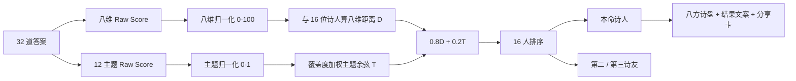

# 中国诗人「诗心鉴」人格匹配模型：研究、量表、题库与前端数据交付

## 执行摘要

本方案把“你与哪位中国诗人最相契”定义为一个**文学人格与审美气质匹配模型**，而不是心理诊断：模型以屈原、陶渊明、李白、杜甫、王维、孟浩然、白居易、李商隐、杜牧、柳永、苏轼、李清照、辛弃疾、陆游、纳兰性德、龚自珍十六位诗人为候选结果，把文学史中较稳定的创作倾向、题材重心、人生姿态和作品中的公共形象，编码为“入世—出世、含蓄—豪放、现实—浪漫、内省—外放、秩序—自由、人间—山水、沉郁—旷达、孤绝—亲世”八条双极轴；用户通过三十二道现代情境题形成同一坐标系下的向量，再以 **80% 八维距离 + 20% 主题亲和度**计算十六位诗人的排序。文学依据优先参考袁行霈主编《中国文学史》、高校古代文学作品选及中国社会科学网、光明日报、中国社会科学院等资料；高教社对《中国文学史》第三版的定位本身即是兼具高校教材与学术研究著作，并强调将作家作品置于文化背景中考察。citeturn12search10turn12search3turn12search9 **所有诗人数值均是“专家初始估值·需用户校准”**：它们不是对历史人物真实心理人格的科学测量，而是为了数字产品建立的、可验证和可迭代的文学编码。题库已做结构平衡：每一维恰好出现八次，每道题只加载两维，而且每个被加载维度的四个选项恰好覆盖 `-3 / -1 / +1 / +3`，从而使八维理论原始范围统一为 `[-24, +24]`。完整的十六诗人、三十二题、主题权重及评分配置已生成可直接使用的数据包。

**可直接下载：**

[完整数据 JSON：poetic_soul_full.json](sandbox:/mnt/data/poetic_soul_full.json)  
[完整前端数据包 ZIP：poetic_soul_frontend_bundle.zip](sandbox:/mnt/data/poetic_soul_frontend_bundle.zip)  
[poets.ts](sandbox:/mnt/data/poets.ts) · [questions.ts](sandbox:/mnt/data/questions.ts) · [dimensions.ts](sandbox:/mnt/data/dimensions.ts) · [themes.ts](sandbox:/mnt/data/themes.ts) · [scoring.ts](sandbox:/mnt/data/scoring.ts)

## 模型边界与八维量表

### 模型到底在测什么

这里最重要的研究边界是：**不要声称“测出了李白/杜甫本人的心理人格”**。

文学史能较可靠讨论的是诗人的作品风格、题材偏好、生命姿态、文学观念及作品中反复出现的精神结构。例如，当前文学史研究仍常用“李白的豪放洒脱、浪漫自由”“杜甫的沉郁顿挫与家国情怀”“白居易的现实关怀与通俗路线”“李商隐的深情朦胧”“杜牧的俊爽清丽”来概括其显著差异。citeturn18search2 王维的山水田园诗则长期被研究为“空”“静”、山水与禅意结合的典型。citeturn14search0

因此，本项目实际建立的是：

```text
历史诗人的作品、生平与文学史公共形象
                    ↓
          专家编码的“诗人人格原型”
                    ↓
     与现代用户的价值偏好、表达方式匹配
```

而不是：

```text
历史人物真实心理测试结果
```

这一差别也决定了产品文案应该写：

> “你的诗心与李白最为相契”

而不是：

> “你的真实人格就是李白。”

### 八维量表定义

为了前端和下文简写，采用以下字段：

| 字段 | 双极维度 | 0 分端 | 100 分端 | 操作性定义 | 对应正式题 |
|---|---|---|---|---|---|
| `engagement` | 入世—出世 | 出世 | 入世 | 面对公共事务、责任、制度与共同体时，是优先保存精神自主，还是愿意进入现实并承担改变责任 | 2、5、9、13、17、21、25、29 |
| `expression` | 含蓄—豪放 | 含蓄 | 豪放 | 情绪与立场更倾向留白、象征和曲折表达，还是直接、强烈、正面表达 | 6、8、12、15、17、22、26、30 |
| `idealism` | 现实—浪漫 | 现实 | 浪漫 | 判断人生时更依赖条件、成本与可行性，还是理想、想象、象征和超越可能 | 1、6、10、14、20、21、27、31 |
| `orientation` | 内省—外放 | 内省 | 外放 | 遭遇重大事件时，更习惯向内理解自己，还是通过行动、交谈、表达进入世界 | 1、4、12、16、19、24、25、31 |
| `freedom` | 秩序—自由 | 秩序 | 自由 | 面对规则、身份与既定路径，更信任共同秩序，还是自我选择、流动性与自主决定 | 2、7、11、14、19、23、26、29 |
| `nature` | 人间—山水 | 人间 | 山水 | 精神注意力主要被城市、人群、职业和世情激活，还是被自然、田园、四时与远景激活 | 4、8、11、13、18、23、27、30 |
| `resilience` | 沉郁—旷达 | 沉郁 | 旷达 | 对失去和挫败，是长久铭记、追问其重量，还是承认伤痛后转化并继续生活 | 3、5、10、16、18、22、28、32 |
| `sociality` | 孤绝—亲世 | 孤绝 | 亲世 | 生命价值更依赖不可被侵入的私人精神空间，还是关系、共情、知己及共同生活 | 3、7、9、15、20、24、28、32 |

这里的“出世”“沉郁”“孤绝”等都**不是负面分**，双极两端不存在高低优劣。例如陶渊明与王维应自然落在较低 `engagement`、较高 `nature` 一侧；杜甫、辛弃疾、陆游则应落在高 `engagement`；这正是模型需要的区分，而不是“分高的人更好”。

各维的极端原型可以理解为：

```text
engagement    0  保全个人精神与生活 ←────────→ 进入现实、承担改变 100
expression    0  留白、象征、含蓄   ←────────→ 直接、强烈、正面 100
idealism      0  条件、经验、落地   ←────────→ 理想、想象、超越 100
orientation   0  独处、反省、自解   ←────────→ 行动、对话、发声 100
freedom       0  稳定、规范、秩序   ←────────→ 自主、流动、自决 100
nature        0  城市、人群、人情   ←────────→ 山川、田园、四时 100
resilience    0  铭记、追问、承担   ←────────→ 转化、松动、继续 100
sociality     0  私人世界、孤绝     ←────────→ 联结、共情、亲世 100
```

例如“入世—出世”并非简单拿“做不做官”来问，而会通过“不合理规则是否介入”“团队出了问题是否先承担”“理想无法实现是否继续行动”等现代场景测量；“山水—人间”也不会直接问“你喜欢山还是城市”，而通过空白假期、居住地、秋日散步、节庆记忆等场景间接观测。这样的间接设计能降低被试故意“做成李白/苏轼”的可能性。

### 主题层

八维负责“**你如何活**”，主题层负责“**什么最容易触动你**”。

当前使用十二个主题：

```ts
country        家国
people         民生 / 公共生活
landscape      山水
pastoral       田园
love           情爱
wandering      漂泊 / 远行
homeland       故乡
friendship     友情 / 交游
wine           诗酒 / 宴饮
city           都市 / 市井
transcendence  哲思 / 超越
history        历史 / 咏史
```

其中 `wine` 是文学意义上的“诗酒、宴饮、欢聚、放达意象”，**不是测用户现实中的饮酒行为**。

## 十六位诗人的初始人格画像

### 完整诗人矩阵

下表中八个数字依次对应产品最终八方诗盘的八根轴。所有数值均为本项目的**专家初始编码，不是历史事实值，需用户校准**。

| id | 诗人 | 朝代 | 代表作 | 核心人格关键词 | 入世 | 豪放 | 浪漫 | 外放 | 自由 | 山水 | 旷达 | 亲世 | 主题权重示例 |
|---|---|---|---|---|---:|---:|---:|---:|---:|---:|---:|---:|---|
| `qu-yuan` | 屈原 | 战国·楚 | 《离骚》《天问》《九章》 | 理想、忠贞、悲剧性、抗争 | 98 | 88 | 94 | 78 | 72 | 38 | 12 | 34 | 家国 1.00、超越 .95、故乡 .85、历史 .80 |
| `tao-yuanming` | 陶渊明 | 东晋 | 《归园田居》《饮酒》《桃花源诗》 | 自然、自由、真率、归隐 | 18 | 34 | 66 | 24 | 94 | 96 | 90 | 52 | 田园 1.00、山水 .90、诗酒 .90、故乡 .80 |
| `li-bai` | 李白 | 唐 | 《将进酒》《蜀道难》《行路难》 | 浪漫、自由、豪情、想象 | 58 | 97 | 98 | 88 | 98 | 78 | 86 | 68 | 漂泊 1.00、诗酒 1.00、山水 .90、超越 .90 |
| `du-fu` | 杜甫 | 唐 | 《春望》《三吏》《三别》《登高》 | 责任、现实、悲悯、沉郁 | 99 | 64 | 28 | 52 | 34 | 38 | 18 | 82 | 家国 1.00、民生 1.00、故乡 .90、漂泊 .85 |
| `wang-wei` | 王维 | 唐 | 《山居秋暝》《鹿柴》《终南别业》 | 清寂、山水、禅意、内观 | 40 | 26 | 60 | 20 | 70 | 99 | 84 | 42 | 山水 1.00、超越 1.00、田园 .80、友情 .55 |
| `meng-haoran` | 孟浩然 | 唐 | 《春晓》《过故人庄》《望洞庭湖赠张丞相》 | 山水、淡泊、真情、游历 | 34 | 42 | 60 | 38 | 76 | 95 | 74 | 66 | 山水 1.00、田园 .90、友情 .85、漂泊 .80 |
| `bai-juyi` | 白居易 | 唐 | 《琵琶行》《卖炭翁》《长恨歌》 | 人间、现实、共情、通达 | 91 | 60 | 34 | 66 | 48 | 30 | 76 | 92 | 民生 1.00、情爱 .75、友情 .75、都市 .75 |
| `li-shangyin` | 李商隐 | 唐 | 《锦瑟》《无题》《夜雨寄北》 | 深情、朦胧、含蓄、幽微 | 54 | 16 | 90 | 16 | 56 | 34 | 14 | 38 | 情爱 1.00、超越 .75、历史 .65、漂泊 .55 |
| `du-mu` | 杜牧 | 唐 | 《赤壁》《泊秦淮》《山行》 | 俊爽、锋利、风流、咏史 | 76 | 84 | 64 | 78 | 78 | 44 | 62 | 74 | 历史 1.00、都市 .75、家国 .70、漂泊 .65 |
| `liu-yong` | 柳永 | 北宋 | 《雨霖铃》《八声甘州》《望海潮》 | 多情、市井、羁旅、真切 | 38 | 30 | 82 | 64 | 78 | 24 | 26 | 94 | 情爱 1.00、漂泊 1.00、都市 1.00、民生 .65 |
| `su-shi` | 苏轼 | 北宋 | 《念奴娇·赤壁怀古》《定风波》《水调歌头》 | 旷达、丰富、入世、超越 | 82 | 90 | 70 | 74 | 84 | 70 | 98 | 94 | 超越 1.00、友情 .95、山水 .85、诗酒 .85 |
| `li-qingzhao` | 李清照 | 两宋之际 | 《声声慢》《如梦令》《醉花阴》 | 敏感、自持、婉约、记忆 | 50 | 20 | 80 | 18 | 72 | 38 | 30 | 68 | 情爱 .95、故乡 .90、漂泊 .80、诗酒 .55 |
| `xin-qiji` | 辛弃疾 | 南宋 | 《永遇乐·京口北固亭怀古》《破阵子》《青玉案·元夕》 | 英雄、家国、豪放、不甘 | 100 | 96 | 78 | 86 | 80 | 38 | 24 | 72 | 家国 1.00、历史 1.00、故乡 .95、民生 .65 |
| `lu-you` | 陆游 | 南宋 | 《示儿》《十一月四日风雨大作》《书愤》 | 家国、执着、坚韧、日常 | 99 | 80 | 56 | 68 | 58 | 48 | 32 | 76 | 家国 1.00、故乡 .95、历史 .80、山水 .65 |
| `nalan-xingde` | 纳兰性德 | 清 | 《木兰花·拟古决绝词柬友》《浣溪沙·谁念西风独自凉》《长相思》 | 深情、孤独、真率、哀婉 | 28 | 14 | 94 | 14 | 72 | 52 | 10 | 48 | 情爱 1.00、漂泊 .85、故乡 .65、超越 .65 |
| `gong-zizhen` | 龚自珍 | 清 | 《己亥杂诗》《病梅馆记》《咏史》 | 改革、锋芒、理想、批判 | 96 | 90 | 92 | 84 | 96 | 32 | 50 | 66 | 历史 1.00、家国 .95、超越 .70、民生 .70 |

唐代五人的区分不是凭空设定：近期中国社会科学网对唐宋文学演进的概括直接把李白概括为豪放洒脱、浪漫自由，把杜甫概括为沉郁顿挫、法度森严且以家国为念，把白居易归于现实/通俗一路，同时称李商隐“深情朦胧”、杜牧“俊爽清丽”。citeturn18search2 国家社科基金相关李杜研究也强调李白更适于自由抒情的古体、杜甫更擅长在格律约束中表现现实与时事，两人的审美结构差异明显。citeturn16search2

### 每位诗人的八维数值依据

**屈原 — `98 / 88 / 94 / 78 / 72 / 38 / 12 / 34`。** `engagement=98` 来自其作品与后世接受中极强的政治理想、共同体命运与现实抗争；`idealism=94`、`expression=88` 对应《离骚》《天问》中显著的理想执着、神话想象和强烈自我表达；`resilience=12` 不是说“软弱”，而是把其拒绝把悲剧轻易消解、将理想冲突承担到底编码为“沉郁端”。新华社及相关文学研究都把屈原与理想坚持、浪漫想象及独立创作传统联系在一起。citeturn16search12turn16search8

**陶渊明 — `18 / 34 / 66 / 24 / 94 / 96 / 90 / 52`。** `engagement=18` 与 `freedom=94` 对应主动离开官场、“归去”与保持性情自然；`nature=96` 来自田园、耕作和乡土空间在其作品中的核心位置；`resilience=90` 则编码其“委运顺化”、在有限现实中重建生命秩序的能力，而并非“天天乐观”。现代陶渊明研究同样强调归隐、自然、日常自得以及自然生命哲学。citeturn19search2turn19search11turn19search13

**李白 — `58 / 97 / 98 / 88 / 98 / 78 / 86 / 68`。** `expression=97`、`idealism=98`、`freedom=98` 是十六人中最鲜明的一组，直接编码其豪放、浪漫、个体性与自由精神；`engagement=58` 没有压到低位，是因为李白并非纯粹避世者，其功业愿望与现实关切仍然存在。文学史研究明确把李白的浪漫自由与杜甫的现实、法度作为关键差异。citeturn18search2turn16search18

**杜甫 — `99 / 64 / 28 / 52 / 34 / 38 / 18 / 82`。** `engagement=99`、`sociality=82` 对应家国、民生、普通人的苦难与社会责任；`idealism=28` 表示相对于李白，其诗歌更贴近现实历史经验；`resilience=18` 则将“沉郁顿挫”以及苦难经验被长期保存而非轻易超越编码进量表。中国社会科学网对杜甫“以家国为念”的概括及诗教研究对其现实、民生关怀的讨论支持这一方向。citeturn18search2turn12search0

**王维 — `40 / 26 / 60 / 20 / 70 / 99 / 84 / 42`。** 最重要的是 `nature=99`、`orientation=20`、`expression=26` 与 `resilience=84`：山水、空静、内观和超越性的宁静构成其主要原型，而不是强烈社会表达。中国社会科学网关于王维的研究直接指出其山水田园诗营造“空”“静”意境并把禅意融入自然世界。citeturn14search0

**孟浩然 — `34 / 42 / 60 / 38 / 76 / 95 / 74 / 66`。** 他与王维同样高 `nature`，但 `sociality=66`、`orientation=38` 更高，用来体现交游、行旅和较温暖的人情维度；同时并不把他编码成彻底避世，因为《望洞庭湖赠张丞相》等作品显示其与现实仕进仍有联系。光明日报/中国作家网对孟浩然的研究把山水田园、隐逸、游历和山川作为其重要精神空间，央视资料也强调其广泛交游。citeturn18search4turn18search12

**白居易 — `91 / 60 / 34 / 66 / 48 / 30 / 76 / 92`。** `engagement=91`、`sociality=92`、`nature=30` 体现其诗歌强烈的社会、人间与日常观察；`idealism=34` 对应现实主义和“为时而著、为事而作”的文学自觉；`resilience=76` 用来区分他与杜甫式沉郁，使其更偏日常通达。白居易诗歌的现实关怀、民生意识和平易通俗特征有明确文学史依据。citeturn18search15turn18search3

**李商隐 — `54 / 16 / 90 / 16 / 56 / 34 / 14 / 38`。** `expression=16`、`orientation=16`、`idealism=90` 是其核心：复杂经验经象征、隐喻、含混关系与内部化情感表达，而不是正面宣告；`resilience=14` 则把记忆、遗憾和难以消解的情绪重量编码为沉郁端。中国社会科学网用“深情朦胧”概括李商隐的中晚唐审美位置。citeturn18search2

**杜牧 — `76 / 84 / 64 / 78 / 78 / 44 / 62 / 74`。** 他不能简单被归入“浪漫诗人”或“现实诗人”，故多数值落在中高区；较高 `expression`、`orientation` 与 `engagement` 用来表达俊爽、锋利、议论性和历史意识，`history=1.00` 又通过主题层进一步拉开他与苏轼、李白的距离。文学史研究以“俊爽清丽”概括杜牧，与李商隐的深情朦胧形成很有价值的一对结果原型。citeturn18search2

**柳永 — `38 / 30 / 82 / 64 / 78 / 24 / 26 / 94`。** 这里故意没有把“婉约”直接等同于低外放：柳永语言表达可以通俗真切、面向都市听众，所以 `expression=30` 较含蓄而 `orientation=64`、`sociality=94` 较高；主题则把情爱、羁旅、都市均设为 `1.00`。相关研究把柳词的重要内容分为艳情、羁旅、承平都市等，且其羁旅词反复围绕离别、归思和行役展开。citeturn14search1turn14search9

**苏轼 — `82 / 90 / 70 / 74 / 84 / 70 / 98 / 94`。** 苏轼的核心不是某一端极端化，而是高度整合：入世与超越、社会关系与个人自由、山水与人间同时较高；真正拉开距离的是 `resilience=98`，用于表达其面对贬谪与困境时极强的转化、超越和旷达能力。文学史常以“旷达”概括苏轼，相关研究也持续以其生命境界和对生活意义的反思作为核心。citeturn14search2turn14search22turn18search10

**李清照 — `50 / 20 / 80 / 18 / 72 / 38 / 30 / 68`。** `expression=20` 与 `orientation=18` 对应婉约、细密和内向情感处理，`idealism=80` 体现高度象征化和审美化的情感世界；`resilience=30` 则受到南渡后国破、漂泊、丧偶以及大量记忆性作品的影响。但她不应被设计成“柔弱人格”，因此 `freedom=72`、`sociality=68` 保留其才情、自持与现实生命力度。关于李清照，权威/主流文学介绍既强调婉约，也提醒她具有坚强乃至豪迈的一面。citeturn14search3turn14search15turn14search19

**辛弃疾 — `100 / 96 / 78 / 86 / 80 / 38 / 24 / 72`。** `engagement=100`、`expression=96` 直接编码其政治行动、恢复理想和豪放表达；`idealism=78` 是未完成的英雄愿景，`resilience=24` 则对应理想长期受阻后的悲壮、不甘和沉郁，而不是苏轼式超然。史料与文学概述都把辛弃疾的抗金经历、积极入世、民族使命与豪放词风联系在一起。citeturn15search13turn15search17turn18search10

**陆游 — `99 / 80 / 56 / 68 / 58 / 48 / 32 / 76`。** `engagement=99` 几乎与杜甫、辛弃疾并列，源于家国主题贯穿其长久创作；`idealism=56` 和 `expression=80` 则比辛弃疾稍低，体现更长期、日常化的坚持；`resilience=32` 保留其未酬报国理想带来的执念。中国社会科学院关于陆游研究的报道明确把其定位为宋代爱国诗人的杰出代表。citeturn15search3turn15search1

**纳兰性德 — `28 / 14 / 94 / 14 / 72 / 52 / 10 / 48`。** `expression=14`、`orientation=14`、`resilience=10` 和 `idealism=94` 构成最典型的“深情—内向—不可轻解”的结果原型；但 `sociality=48` 并未压得很低，因为文献同样显示他极重友情，并主动与江南文人建立深厚交游。纳兰词常被概括为真挚、自然、哀婉，其爱情、悼亡、边塞和友情作品均重要。citeturn15search4turn15search11

**龚自珍 — `96 / 90 / 92 / 84 / 96 / 32 / 50 / 66`。** 其原型有意设计成高入世、高理想、高自由、高表达，以区别传统“山水诗人”和“情词诗人”；主题层又将历史、家国、民生置于高位，对应近代转型前夕的批判意识和改革思维。中国人民大学清史研究资料库收录的研究即把“社会批判思想”“政治改革思想”作为龚自珍研究的重要方向。citeturn19search3

这十六人之间存在一些**刻意保留的近邻**：陶渊明—王维—孟浩然，李商隐—纳兰性德—李清照，辛弃疾—陆游—龚自珍，以及李白—苏轼—杜牧。若只用八维，很容易接近；主题层的意义正是继续利用“田园/禅意/友情”“情爱/故乡/漂泊”“家国/历史/民生”“诗酒/山水/咏史”等差异进行第二层辨别。

## 三十二道正式情境题与隐藏评分

以下即正式 V1 题库。记号直接对应 `questions.ts` 字段，例如：

```text
[idealism:+3, orientation:+1 | wandering:+2, transcendence:+1]
```

表示该答案对两条主维度及主题层产生这些隐藏增量。**前端绝不向用户展示这些值。**

**Q01 · 远行**  
一场筹谋已久的远行忽然被取消。你独自在窗前坐到天黑，更接近哪一种反应？

A　反而开始想象那条未走成的路，觉得它因此多了一层命运感。  
`[idealism:+3, orientation:+1 | wandering:+2, transcendence:+1]`

B　把失落写下来或独自消化，慢慢弄清自己真正期待的是什么。  
`[idealism:+1, orientation:-3 | wandering:+1, transcendence:+1]`

C　接受变化，重新计算时间、预算和现实条件，再决定是否出发。  
`[idealism:-3, orientation:-1 | wandering:+1]`

D　马上联系同行者、改票或重排路线，先把能做的事情做起来。  
`[idealism:-1, orientation:+3 | wandering:+2, friendship:+1]`

**Q02 · 规则**  
你发现自己身处一个并不合理、但所有人都已经习惯的规则中。你最可能？

A　公开指出问题，并尝试组织人一起推动改变。  
`[engagement:+3, freedom:+1 | people:+2, country:+1]`

B　先承担自己的职责，但会寻找规则允许范围内的改良空间。  
`[engagement:+1, freedom:-3 | people:+1, country:+1]`

C　尽量减少参与，把精力转向不被这套规则支配的生活。  
`[engagement:-3, freedom:-1 | pastoral:+1, transcendence:+1]`

D　必要时直接离开，我不愿用长期服从换取稳定。  
`[engagement:-1, freedom:+3 | wandering:+1, transcendence:+1]`

**Q03 · 失去**  
一件你非常珍惜的事已经无法挽回。很多年后，你觉得自己更可能怎样记住它？

A　它会变成理解他人的经验，伤口仍在，但我愿意继续靠近人群。  
`[resilience:+3, sociality:+1 | people:+1, friendship:+1, love:+1]`

B　我会慢慢放下，却把最深的部分留在心里，不太向人解释。  
`[resilience:+1, sociality:-3 | transcendence:+1]`

C　它会长期改变我看待世界的方式，也让我更谨慎地进入关系。  
`[resilience:-3, sociality:-1 | love:+1, transcendence:+1]`

D　我会不断与信任的人谈起它，因为共同记忆本身就是一种保存。  
`[resilience:-1, sociality:+3 | friendship:+2, love:+1]`

**Q04 · 休息**  
突然得到三天空白假期，没有任何必须完成的事。你最想把它交给什么？

A　独自去看一片陌生山水，边走边想，回来再说。  
`[nature:+3, orientation:-1 | landscape:+2, wandering:+1]`

B　找一个安静地方待着，不安排景点，只让自己慢下来。  
`[nature:+1, orientation:-3 | pastoral:+1, transcendence:+1]`

C　留在熟悉的城市，去市场、旧街、咖啡馆，看真实生活流动。  
`[nature:-3, orientation:+1 | city:+2, people:+1]`

D　约朋友一起吃饭、逛展或临时出门，让假期被具体的人填满。  
`[nature:-1, orientation:+3 | friendship:+2, city:+1, wine:+1]`

**Q05 · 受挫**  
你为一件重要的事努力很久，最终仍然失败。第一周过去后，你更倾向？

A　把经验整理出来，再试一次或换一种方式继续做。  
`[engagement:+3, resilience:+1 | people:+1, country:+1]`

B　承认失败，先恢复生活节奏，但仍保留以后重启的可能。  
`[engagement:+1, resilience:+3 | transcendence:+1]`

C　开始怀疑这件事是否值得，宁愿退出，重新定义自己要的生活。  
`[engagement:-3, resilience:-1 | pastoral:+1, transcendence:+1]`

D　很难轻轻翻篇；我会反复回看哪里出了问题，以及它意味着什么。  
`[engagement:-1, resilience:-3 | history:+1, transcendence:+1]`

**Q06 · 告白**  
面对一段重要但不确定的感情，你终于决定表达。你更接近哪种方式？

A　把最强烈的感受直接说出来，即使显得夸张也没关系。  
`[expression:+3, idealism:+1 | love:+2]`

B　用一个意象、一封信或一段含蓄的话，让对方自己读懂。  
`[expression:-3, idealism:+3 | love:+2, transcendence:+1]`

C　尽量说明彼此的现实处境和边界，不让情绪掩盖问题。  
`[expression:-1, idealism:-3 | love:+1]`

D　坦率表达喜欢，同时把未来能否成立的问题一起谈清楚。  
`[expression:+1, idealism:-1 | love:+2, people:+1]`

**Q07 · 身份**  
一份稳定体面的工作与你真正想做的事发生冲突。你会怎样权衡？

A　优先选择真正想做的事，但会尽量照顾身边人的现实感受。  
`[freedom:+1, sociality:+1 | friendship:+1, love:+1]`

B　先维持稳定，因为我不愿让自己的选择把压力转嫁给家人或伙伴。  
`[freedom:-3, sociality:+3 | people:+1, love:+1]`

C　接受稳定路径，只要它能让我保留一个不受打扰的私人世界。  
`[freedom:-1, sociality:-3 | transcendence:+1]`

D　哪怕暂时独自承担后果，我也更愿意离开既定轨道。  
`[freedom:+3, sociality:-1 | wandering:+1, transcendence:+1]`

**Q08 · 夜景**  
旅行中你站在高处俯瞰一座陌生城市。真正让你停留最久的会是？

A　城市之外的江、山、云和天际线，我会忍不住拍下整片远景。  
`[nature:+3, expression:+1 | landscape:+2, wandering:+1]`

B　某个极安静的细节：一盏远灯、一阵风、树影落在墙上。  
`[nature:+1, expression:-3 | landscape:+1, transcendence:+1]`

C　街道、人群、摊贩和车流，它们比远山更让我觉得有故事。  
`[nature:-3, expression:-1 | city:+2, people:+1]`

D　我会立刻把眼前的繁华与同行者分享，甚至兴奋地描述给别人听。  
`[nature:-1, expression:+3 | city:+2, friendship:+1]`

**Q09 · 争议**  
朋友群里因为一件公共事件发生争论，你掌握的信息比较充分。你会？

A　把事实和立场讲清楚，也愿意承担争论带来的不舒服。  
`[engagement:+3, sociality:+1 | people:+2, country:+1]`

B　私下和几个关键的人沟通，希望关系不被立场彻底撕裂。  
`[engagement:+1, sociality:+3 | friendship:+2, people:+1]`

C　不参与。我更愿意保留判断，不把自己卷入群体情绪。  
`[engagement:-3, sociality:-1 | transcendence:+1]`

D　沉默退出讨论；比起说服别人，我更想保护自己的内在秩序。  
`[engagement:-1, sociality:-3 | transcendence:+2]`

**Q10 · 旧物**  
整理房间时，你忽然翻到十年前的一件旧物。你最可能？

A　把它当作时间留下的暗号，想到很多已经不存在的人和可能性。  
`[idealism:+3, resilience:-1 | history:+1, love:+1, transcendence:+1]`

B　感慨一会儿，把它收好；过去很重要，但今天仍要继续。  
`[idealism:+1, resilience:+3 | homeland:+1, transcendence:+1]`

C　判断它是否还有实际价值，没有就整理掉，不让纪念物占据生活。  
`[idealism:-3, resilience:+1 | city:+1]`

D　会被它拉回过去很久，甚至重新检查当年的每一个决定。  
`[idealism:-1, resilience:-3 | history:+2, homeland:+1]`

**Q11 · 居所**  
假如未来五年只能选择一种生活环境，你更容易长期安顿在哪里？

A　离城市不远但有山有水的小地方，保持流动与自主。  
`[freedom:+3, nature:+1 | landscape:+2, pastoral:+1]`

B　秩序成熟、资源稳定的大城市核心区。  
`[freedom:-3, nature:-1 | city:+2]`

C　熟悉的社区或故乡附近，生活节奏可预期、关系稳定。  
`[freedom:-1, nature:-3 | homeland:+2, people:+1]`

D　更偏远的自然环境，只要能让我按自己的节奏生活。  
`[freedom:+1, nature:+3 | landscape:+2, pastoral:+2]`

**Q12 · 批评**  
有人公开批评你的作品或观点，而且其中有一部分确实击中了问题。你会？

A　直接回应：承认对的部分，也明确反驳我不同意的部分。  
`[expression:+3, orientation:+1 | people:+1]`

B　先不回应，独自把那句话想透，等真正形成判断再说。  
`[expression:-1, orientation:-3 | transcendence:+1]`

C　用下一次作品做回应，不解释，让表达本身留下余地。  
`[expression:-3, orientation:-1 | transcendence:+1]`

D　找对方或同行深入讨论，在对话中重新整理自己的立场。  
`[expression:+1, orientation:+3 | friendship:+1, people:+1]`

**Q13 · 周末**  
长期忙碌后，你终于拥有一个完全属于自己的周末。哪种安排最像你？

A　参加一个有实际作用的志愿、社区或公共活动，再去郊外走走。  
`[engagement:+3, nature:+1 | people:+2, landscape:+1]`

B　处理一直拖着的现实事务，让生活重新有秩序。  
`[engagement:+1, nature:-3 | city:+1, people:+1]`

C　关掉消息，去山里、河边或植物很多的地方待一整天。  
`[engagement:-3, nature:+3 | landscape:+2, pastoral:+1]`

D　不做有用的事，只在附近散步、做饭、读书，让日常慢下来。  
`[engagement:-1, nature:-1 | pastoral:+2]`

**Q14 · 承诺**  
一个你很想抓住的新机会，会打乱已经答应别人的长期安排。你更倾向？

A　争取新机会。我不想因为既定安排错过可能改变人生的窗口。  
`[freedom:+3, idealism:+1 | wandering:+1, transcendence:+1]`

B　先和相关的人重新协商，尽量让理想与承诺都保留下来。  
`[freedom:+1, idealism:+3 | friendship:+1, love:+1]`

C　遵守原先承诺。再好的可能性也不能建立在失信上。  
`[freedom:-3, idealism:-1 | people:+1]`

D　评估收益、风险和时间成本，哪个方案更可持续就选哪个。  
`[freedom:-1, idealism:-3 | city:+1]`

**Q15 · 离别**  
一个与你关系很深的人即将长期离开。送别那天，你更可能？

A　认真说出舍不得，也约定以后如何继续保持联系。  
`[expression:+3, sociality:+1 | friendship:+2, love:+1]`

B　准备一份只有你们懂的礼物或文字，把最重的话藏在里面。  
`[expression:-3, sociality:-1 | friendship:+2, love:+1]`

C　尽量把场面处理得轻一些，不让彼此承受太多情绪。  
`[expression:-1, sociality:-3 | wandering:+1]`

D　会和很多共同朋友一起送他，觉得告别也需要被共同见证。  
`[expression:+1, sociality:+3 | friendship:+2]`

**Q16 · 误解**  
你被重要的人严重误解，而短时间内很难解释清楚。你会？

A　尽快沟通，即使一次说不清，也不愿让误解自然发酵。  
`[orientation:+3, resilience:+1 | friendship:+1, love:+1]`

B　先让时间过去，等情绪降低后再找一个更好的解释机会。  
`[orientation:+1, resilience:+3 | friendship:+1]`

C　先回到自己内部，反复确认：我真正介意的是误解，还是不被理解。  
`[orientation:-3, resilience:-1 | transcendence:+1]`

D　这件事会停留很久；即使后来讲开，我也会记得关系曾经出现过裂缝。  
`[orientation:-1, resilience:-3 | love:+1, history:+1]`

**Q17 · 不公**  
你亲眼看到一个能力很强的人因为偏见而失去机会。你会？

A　明确替他发声，并指出问题在哪里。  
`[engagement:+3, expression:+1 | people:+2]`

B　用更强硬公开的方式挑战这个决定，哪怕会得罪人。  
`[engagement:+1, expression:+3 | people:+2, country:+1]`

C　觉得愤怒，但不愿卷入；我会私下提供实际帮助。  
`[engagement:-1, expression:-3 | friendship:+1, people:+1]`

D　尽量离这种环境远一点，我不相信一次争论能改变结构。  
`[engagement:-3, expression:-1 | transcendence:+1]`

**Q18 · 秋天**  
你一个人在深秋傍晚走很久，忽然感到时间过得很快。哪种念头更接近你？

A　看着季节变化反而觉得安心：万物本就有来有去。  
`[nature:+3, resilience:+3 | landscape:+2, transcendence:+1]`

B　自然越平静，我越容易想起那些已经失去的人和事。  
`[nature:+1, resilience:-1 | landscape:+1, homeland:+1, love:+1]`

C　我会回到具体生活：吃点热的、回家、把明天安排好。  
`[nature:-3, resilience:+1 | city:+1, people:+1]`

D　想到过去与未来的落差，会有一种很难迅速排解的惆怅。  
`[nature:-1, resilience:-3 | history:+1, transcendence:+1]`

**Q19 · 路线**  
你要完成一件重要但路径完全不确定的事。你更舒服的方式是？

A　先定大方向，然后边走边改；我喜欢给偶然性留下位置。  
`[freedom:+3, orientation:+1 | wandering:+1]`

B　自己先想很久，确认这条路值得，再开始行动。  
`[freedom:+1, orientation:-3 | transcendence:+1]`

C　建立明确计划、节点和规则，减少不必要的不确定性。  
`[freedom:-3, orientation:-1 | city:+1]`

D　尽快找人讨论、试做，在现实反馈中迭代路线。  
`[freedom:-1, orientation:+3 | friendship:+1, people:+1]`

**Q20 · 关系**  
一段关系正在变淡，却没有发生明确冲突。你更可能？

A　相信有些关系会以另一种形式继续，不急着给它判定结束。  
`[idealism:+3, sociality:+1 | love:+1, friendship:+1, transcendence:+1]`

B　主动约对方谈谈，因为关系值得用具体行动维护。  
`[idealism:+1, sociality:+3 | friendship:+2, love:+1]`

C　接受关系有生命周期，不会只因过去亲密就强行维持。  
`[idealism:-3, sociality:-1 | history:+1]`

D　慢慢退回自己的生活；有些变化不必被解释给任何人。  
`[idealism:-1, sociality:-3 | transcendence:+1]`

**Q21 · 理想**  
你发现自己多年来坚持的理想，在现实中几乎不可能完整实现。你更接近？

A　仍然要做，哪怕只能推进一点，现实不足以取消它的价值。  
`[engagement:+3, idealism:+1 | country:+1, people:+1, transcendence:+1]`

B　保留理想，但把它拆成真正能完成的小目标。  
`[engagement:+1, idealism:-1 | people:+1]`

C　不再让理想支配生活；能把自己的日子过好也有价值。  
`[engagement:-3, idealism:-3 | pastoral:+1]`

D　我可能放弃现实行动，却仍愿在精神上相信那个更好的世界。  
`[engagement:-1, idealism:+3 | transcendence:+2]`

**Q22 · 痛苦**  
当你经历一段很难对人说明的痛苦时，你更容易通过什么方式处理？

A　把它说出来，甚至用很强烈的语言承认自己正在受伤。  
`[expression:+3, resilience:-1 | friendship:+1, love:+1]`

B　写成文字、作品或某种间接表达，让它慢慢变成别的东西。  
`[expression:-3, resilience:+1 | transcendence:+2]`

C　尽快恢复工作和生活，用行动把注意力带回现在。  
`[expression:-1, resilience:+3 | people:+1, city:+1]`

D　我会长久地记住它，也许多年以后仍会反复讲述那一刻。  
`[expression:+1, resilience:-3 | history:+1, love:+1]`

**Q23 · 迁居**  
你有机会搬去一个更适合自己、但离熟人网络很远的地方。你最在意什么？

A　那里的空间和环境是否让我感到舒展；关系可以重新建立。  
`[freedom:+3, nature:+3 | landscape:+2, wandering:+1]`

B　是否有稳定的制度、工作与生活配套，陌生并不是最大问题。  
`[freedom:-3, nature:-1 | city:+2]`

C　离原来的家和朋友太远会让我犹豫，熟悉的人间关系很重要。  
`[freedom:-1, nature:-3 | homeland:+2, friendship:+1]`

D　只要能保留自主生活方式，又有一点能独处的自然空间，就可以。  
`[freedom:+1, nature:+1 | transcendence:+1]`

**Q24 · 夜谈**  
一次很长的朋友夜谈结束后，你最享受的部分通常是什么？

A　在说出口的过程中，我忽然更明白自己原来在想什么。  
`[orientation:+3, sociality:+1 | friendship:+2]`

B　我们一起把一个问题越谈越开，产生了原本没有的新想法。  
`[orientation:+1, sociality:+3 | friendship:+2, transcendence:+1, wine:+1]`

C　其实我更喜欢听；真正重要的东西，往往会留到独处后才消化。  
`[orientation:-3, sociality:-1 | friendship:+1]`

D　夜谈之后我反而需要很长独处，重新把自己和别人分开。  
`[orientation:-1, sociality:-3 | transcendence:+1]`

**Q25 · 责任**  
一个团队项目出现严重问题，而问题并不主要由你造成。你会？

A　先站出来解决，再讨论责任归属；眼下最重要的是让事情恢复。  
`[engagement:+3, orientation:+3 | people:+2]`

B　承担自己那一部分，并清楚说明哪些不属于自己的责任。  
`[engagement:+1, orientation:-1 | people:+1]`

C　我会先想清楚整个机制为什么会出错，而不是立刻进入救火模式。  
`[engagement:-1, orientation:-3 | history:+1, transcendence:+1]`

D　若长期结构有问题，我会考虑退出，而不是一次次替系统兜底。  
`[engagement:-3, orientation:+1 | wandering:+1]`

**Q26 · 传统**  
一个你尊重的传统习惯，与自己的真实感受发生冲突。你通常会？

A　坦白说出不认同，也会按自己的方式做。  
`[expression:+3, freedom:+3 | history:+1]`

B　保留自己的选择，但表达得尽量温和，不把冲突扩大。  
`[expression:-3, freedom:+1 | history:+1, people:+1]`

C　即使不完全认同，也愿意遵守，因为共同秩序有它的价值。  
`[expression:-1, freedom:-3 | history:+1, people:+1]`

D　和相关的人谈清楚边界，寻找既不违心也不破坏关系的办法。  
`[expression:+1, freedom:-1 | friendship:+1, people:+1]`

**Q27 · 故乡**  
多年后回到曾经生活过的地方，景物已经改变很多。你最容易注意到什么？

A　现实已经变了，但记忆里的那个地方似乎仍与眼前重叠。  
`[idealism:+3, nature:+1 | homeland:+2, transcendence:+1]`

B　树、河流、气味、季节这些比建筑更长久的东西。  
`[idealism:+1, nature:+3 | landscape:+2, homeland:+1]`

C　新开的店、道路、人群和生活方式；变化本身最值得观察。  
`[idealism:-3, nature:-1 | city:+2, people:+1]`

D　我会比较过去与现在的真实差异，而不是沉浸在怀旧里。  
`[idealism:-1, nature:-3 | homeland:+1, history:+1]`

**Q28 · 孤独**  
连续独处很久后，你如何判断自己“够了”？

A　当我重新愿意对别人产生好奇，就会主动回到人群。  
`[resilience:+3, sociality:+3 | friendship:+1, people:+1]`

B　独处本身能让我恢复，之后是否见人并没有固定需求。  
`[resilience:+1, sociality:-3 | transcendence:+1]`

C　越孤独越容易想起旧关系，我常常很难主动打破那个循环。  
`[resilience:-3, sociality:-1 | love:+1, history:+1]`

D　我会联系最信任的人；有些情绪只有在关系里才能真正过去。  
`[resilience:-1, sociality:+1 | friendship:+2, love:+1]`

**Q29 · 机会**  
你被邀请进入一个能产生影响力、但会显著限制个人时间的职位。你会？

A　接受。既然有能力影响事情，就应该承担一部分责任。  
`[engagement:+3, freedom:-1 | country:+1, people:+2]`

B　接受，但会努力争取更大的自主空间，不让职位吞掉全部生活。  
`[engagement:+1, freedom:+3 | people:+1]`

C　拒绝。外部影响力并不是我衡量生活价值的主要尺度。  
`[engagement:-3, freedom:+1 | pastoral:+1, transcendence:+1]`

D　倾向拒绝，因为清晰稳定的生活边界对我更重要。  
`[engagement:-1, freedom:-3 | pastoral:+1]`

**Q30 · 盛会**  
参加一场盛大的节庆或演出，你回家后最可能记住什么？

A　最热烈的瞬间：灯火、声音、人群一起爆发，我很容易被带动。  
`[expression:+3, nature:-3 | city:+2, people:+1, wine:+1]`

B　一个很小的片段：散场后的风、地上的花、远处的一轮月。  
`[expression:-3, nature:+3 | landscape:+1, transcendence:+1]`

C　和谁一起去、途中说了什么；事件本身不如人与人的细节重要。  
`[expression:-1, nature:-1 | friendship:+2, love:+1]`

D　场地与自然环境如何共同形成气氛，我会很想把它描述给别人。  
`[expression:+1, nature:+1 | landscape:+1, city:+1]`

**Q31 · 未来**  
当你想象十年后的自己，最先浮现的通常是哪一类画面？

A　一个比现在更辽阔的人生版本：去过更多地方，做过真正想做的事。  
`[idealism:+3, orientation:+1 | wandering:+2, transcendence:+1]`

B　不是具体成就，而是希望那时更理解自己，也更少被外界定义。  
`[idealism:+1, orientation:-3 | transcendence:+2]`

C　稳定的工作、健康、住处和关系；我更相信可持续的具体生活。  
`[idealism:-3, orientation:-1 | city:+1, people:+1]`

D　我会先想到正在做什么、和谁合作、能对周围产生什么影响。  
`[idealism:-1, orientation:+3 | people:+2, country:+1]`

**Q32 · 终章**  
如果多年后回看自己的一生，你最希望哪件事成立？

A　经历过很多变化之后，我仍然有能力喜欢世界，也有人愿意与我同行。  
`[resilience:+3, sociality:+3 | friendship:+2, people:+1, wine:+1]`

B　无论得到失去，我最终学会与自己相处，不再向外界索要答案。  
`[resilience:+1, sociality:-3 | transcendence:+2]`

C　有些东西我始终没有忘，也正因为没有忘，我知道自己真正珍视什么。  
`[resilience:-3, sociality:-1 | history:+1, homeland:+1, love:+1]`

D　我希望那些重要的人知道：他们确实改变过我的生命。  
`[resilience:-1, sociality:+1 | friendship:+2, love:+2]`

这套题有一个值得保留的结构特征：**每一题的四个选项都没有明显“最好答案”**。例如 Q21 的 C 并不是“不上进”，它对应的是陶渊明式“重新定义什么值得过”；Q32 的 C 也不是“不健康”，而是把“记忆本身构成价值”放到沉郁端。否则用户会下意识选择社会赞许度最高的答案，结果会整体向苏轼、白居易一类高亲世、高旷达结果漂移。

## 计分、归一化、相似度与完整示例

### 八维原始分

每题只对两维加分。

设第 \(q\) 题选择的答案为 \(a_q\)，某维度为 \(d\)：

\[
R_d=\sum_{q=1}^{32}\Delta_{q,a_q,d}
\]

当前题库每维恰好出现八次，每次理论极值为 `±3`，所以：

```text
每维理论最小 = 8 × (-3) = -24
每维理论最大 = 8 × (+3) = +24
```

当前可以直接：

\[
U_d=\frac{R_d+24}{48}\times100
\]

但前端实现我推荐**不要硬编码 -24/+24**。`scoring.ts` 已按照实际题库动态扫描每维理论最小值和最大值，因此日后改题不会把归一化公式悄悄弄坏：

```ts
normalized =
  ((raw - theoreticalMin) /
   (theoreticalMax - theoreticalMin)) * 100;
```

### 主题分

每个主题同样积累原始值，但因为不同主题出现次数不同，不能直接拿原始分比较。

例如当前题库理论主题最大值分别为：

| 主题 | 理论最大 |
|---|---:|
| 家国 | 7 |
| 民生 | 32 |
| 山水 | 15 |
| 田园 | 9 |
| 情爱 | 15 |
| 漂泊 | 13 |
| 故乡 | 9 |
| 友情 | 29 |
| 诗酒 | 4 |
| 都市 | 19 |
| 超越 | 33 |
| 历史 | 12 |

因此用户主题值：

\[
u_t=\frac{\text{ThemeRaw}_t}{\text{ThemeMax}_t}
\]

映射到 `[0,1]`。

主题本身只是第二层软信号，所以 `people`、`friendship`、`transcendence` 出现次数较多没有问题；同时，为避免“诗酒”只有四次机会却被当成和二十八次出现的“超越”同等稳定，数据包采用了**覆盖度置信权重**：

\[
c_t=\min(1,\frac{\text{包含该主题的题数}}{8})
\]

例如：

```text
家国     7题 → 0.875
山水     8题 → 1.000
田园     7题 → 0.875
故乡     6题 → 0.750
诗酒     4题 → 0.500
民生    25题 → 1.000
友情    20题 → 1.000
超越    28题 → 1.000
```

### 八维相似度

这里不推荐把八维直接用 cosine similarity。

原因是八维是**有绝对方向意义的双极标尺**：用户 `nature=10` 和诗人 `nature=90` 应明确被视为远距离；使用加权 Manhattan 距离更容易解释。

初始所有维度同权：

\[
D
=
1-
\frac{
\sum_d w_d |U_d-P_d|/100
}{
\sum_d w_d
}
\]

V1：

```text
w_d = 1
```

所以其实就是八维绝对差的平均值。

例如用户 `idealism=83.33`，李白为 `98`，这一维距离就是：

```text
|83.33 - 98| / 100
= 0.1467
```

### 主题亲和度

主题没有“低端和高端”的双极意义，因此这里使用**覆盖度加权余弦相似度**：

\[
T=
\frac{
\sum_t c_tu_tp_t
}{
\sqrt{\sum_t c_tu_t^2}
\sqrt{\sum_t c_tp_t^2}
}
\]

其中：

```text
u_t = 用户归一化主题值
p_t = 诗人的主题权重
c_t = 该主题的题库覆盖置信权重
```

### 最终匹配

首版建议保持：

\[
S=0.80D+0.20T
\]

即：

```ts
finalSimilarity =
  0.8 * dimensionSimilarity +
  0.2 * themeAffinity;
```

**为什么不是 50/50？**

因为诗人结果首先应该由人格姿态决定，题材只是辅助。例如一个非常入世、豪放、英雄主义的用户不应该仅因为喜欢山水就突然被匹配成王维。主题层最适合做近邻诗人的 tie-breaker。

### 展示百分比

千万不要直接把 `S × 100` 写成“准确率”。

它没有这种统计意义。

推荐：

```ts
displayMatch =
  clamp(
    Math.round(50 + 50 * finalSimilarity),
    60,
    97
  );
```

也就是说：

```text
内部 S = 0.86
        ↓
展示 = 93

文案：
诗心相契度 93%

而不是：
人格判断准确率 93%
```

上限设为 97 也是产品性选择：避免给人“科学测量到 100%”的误解。

### 完整假想用户计算

假定一位用户三十二题答案为：

```text
1A  2A  3A  4A
5A  6D  7D  8B
9D 10B 11A 12C
13C 14B 15A 16A
17B 18A 19D 20A
21A 22A 23B 24A
25D 26A 27A 28B
29B 30D 31A 32A
```

把所有隐藏维度加总后：

```text
engagement   +4
expression   +8
idealism    +16
orientation +10
freedom     +10
nature      +12
resilience  +14
sociality     0
```

通过 `(raw + 24) / 48 × 100`：

| 维度 | Raw | 归一化 |
|---|---:|---:|
| 入世 | 4 | 58.33 |
| 豪放 | 8 | 66.67 |
| 浪漫 | 16 | 83.33 |
| 外放 | 10 | 70.83 |
| 自由 | 10 | 70.83 |
| 山水 | 12 | 75.00 |
| 旷达 | 14 | 79.17 |
| 亲世 | 0 | 50.00 |

即：

```text
UserVector = [
  58.33,
  66.67,
  83.33,
  70.83,
  70.83,
  75.00,
  79.17,
  50.00
]
```

其主题原始分：

```text
家国       4 / 7
民生      11 / 32
山水      10 / 15
田园       2 / 9
情爱       8 / 15
漂泊       7 / 13
故乡       3 / 9
友情      12 / 29
诗酒       1 / 4
都市       3 / 19
超越      13 / 33
历史       1 / 12
```

归一化：

```text
country        0.5714
people         0.3438
landscape      0.6667
pastoral       0.2222
love           0.5333
wandering      0.5385
homeland       0.3333
friendship     0.4138
wine           0.2500
city           0.1579
transcendence  0.3939
history        0.0833
```

与李白比较：

```text
用户：
58.33 66.67 83.33 70.83 70.83 75.00 79.17 50.00

李白：
58    97    98    88    98    78    86    68
```

得到：

```text
Dimension similarity D
= 0.853125

Theme affinity T
= 0.899291

Final S
= 0.8 × 0.853125
+ 0.2 × 0.899291

= 0.862358
```

展示：

```text
round(50 + 50 × 0.862358)
= 93
```

同一用户前三位：

| 排名 | 诗人 | 八维相似度 D | 主题亲和 T | 综合 S | 展示相契度 |
|---|---|---:|---:|---:|---:|
| 1 | 李白 | 0.8531 | 0.8993 | **0.8624** | **93%** |
| 2 | 苏轼 | 0.8194 | 0.8961 | **0.8347** | **92%** |
| 3 | 杜牧 | 0.8240 | 0.8223 | **0.8236** | **91%** |

这个例子也说明主题层为什么有用：杜牧在八维上其实比苏轼略接近，但该用户的山水、漂泊、友情、超越等主题组合与苏轼更相合，于是苏轼通过主题亲和度升到第二。

完整数据流可以概括为：



## 校准、验证与上线后的统计标准

首先要明确：COSMIN 等测量学框架强调，量表评价不能只看一个“信度数字”，而应首先关注内容是否相关、全面、可理解，再讨论结构和可靠性。citeturn17search2turn17search16 本项目是娱乐/文化人格测试，不需要冒充临床心理量表，但可以借用这些原则做严谨的产品校准。

### 内容专家校准

第一轮不要先找五百个普通用户，而是找 **5—8 位古代文学背景较强的评审者**，最好覆盖先秦、魏晋、唐宋、清代不同研究方向。

让他们独立完成两件事：

```text
A. 给 16 位诗人按 8 维打 0-100
B. 判断每道题每个选项是否真的代表预设方向
```

不要先给他们看本报告的数字，否则会锚定。

对每位诗人的某维，例如李白 `freedom`：

```text
Expert 1  95
Expert 2  100
Expert 3  90
Expert 4  95
Expert 5  100

中位数 = 95
IQR = 5
```

若某值专家分歧特别大，例如：

```text
李清照 freedom

60
90
55
85
65
```

说明这个维度可能混合了：

- 文学表达自由
- 人生选择自由
- 女性历史处境
- 后世人格想象

此时应该重写维度解释，而不是机械求平均。

### 小样认知访谈

建议先做约 **30—50 人的探索性小样本**。这是本项目的产品研究建议，不是通用统计学硬门槛。

最重要的问题不是“你测出来谁”，而是逐题追问：

> “你选择 B 时，你理解这句话是在表达什么？”

一旦用户对 Q18 B 的理解是：

> “我只是喜欢秋天。”

而你原本想测：

> “自然触发记忆 + 难以完全放下失去。”

就说明题目需要改。

优先观察：

```text
题目读不懂 / 需要反复读       < 5%
两项都无法选择               < 10%
单一答案被 >70% 用户选择     → 检查社会赞许偏差
答题中途退出集中在某题        → 检查题目长度/敏感度
```

这些阈值属于本项目首轮产品启发式标准，不应包装成心理测量学行业标准。

### Beta 数据校准

正式 Beta 推荐积累至少 **150—300 个完整样本**再第一次动权重；达到约 **500+ 完整答卷**以后，再较认真分析结果分布、项目表现和用户分群。这里同样是产品开发建议，而不是统计学最低样本量定理。

重点看：

| 指标 | V1 建议观察线 |
|---|---|
| 开始 → 完成率 | **≥70%** 较理想；低于 60% 优先处理题量与文案 |
| 中位完成时间 | 约 **4—7 分钟** |
| 单题异常停留 | 若明显高于全题中位数 2 倍，检查理解难度 |
| 单答案占比 | 一般避免长期 >70% |
| 16 结果覆盖 | 理想情况下每位都应有稳定用户，不应长期 0% |
| 单诗人占比 | 无特殊流量偏差时，长期 >18% 值得检查 |
| 归一化结果熵 | 建议 `normalized entropy > 0.85` |
| Top1 / Top2 内部分差 | 大量 <0.01 说明模型区分不足；大量 >0.15 可能过度粗暴 |
| 八维维度相关 | 两维长期 `|r| > .75` 时检查是否重复 |
| 7—14 天重测 | 维度 ICC 达 `.75` 左右可视为不错的稳定性目标 |

最后一个 `.75` 有实际测量学依据：Koo 与 Li 的 ICC 指南把 `.75–.90` 解释为 good reliability，`.90+` 为 excellent；但对于这种文学娱乐测试，不应机械追求极高重测一致性，因为人的选择本身会受情境影响。citeturn17search1

### 不要追求“结果完全平均”

十六个人不是必须各占：

```text
6.25%
```

强行平均反而会破坏准确性。

你真正要避免的是：

```text
李白       31%
苏轼       27%
王维       18%

剩下 13 人
加起来     24%
```

这往往意味着题目存在明显的社会赞许偏差：

- 自由选项写得太酷
- 旷达选项永远比沉郁选项“健康”
- 豪放选项更像有行动力的人
- 入世选项更像“正确答案”

这会把流量大量吸到李白、苏轼。

反过来，若纳兰性德、李商隐类结果异常高，要检查“深情、孤独、记忆”选项是不是被写得特别文学化、特别吸引用户。

### 诗人近邻诊断

首版特别需要监控四组：

```text
陶渊明 ↔ 王维 ↔ 孟浩然
李商隐 ↔ 李清照 ↔ 纳兰性德
辛弃疾 ↔ 陆游 ↔ 龚自珍
李白   ↔ 苏轼   ↔ 杜牧
```

当用户 Top1 是其中一位时，在结果页增加：

> “你觉得第二名其实比第一名更像你吗？”

收集：

```ts
{
  predicted: "li-bai",
  runnerUp: "su-shi",
  userPreferred: "su-shi"
}
```

累计数百条后，就能知道模型到底在哪些边界系统性出错。

不要直接根据每个用户自报结果改模型，因为用户可能只是“更喜欢李白”。真正有价值的是：

```text
维度答案
+
模型 Top 3
+
用户觉得谁更像
+
用户原本最喜欢谁
```

把“自我认同”和“文学偏爱”分开。

### 信度不要乱算总 Cronbach α

八维本来就是八种不同构念，因此把三十二题整体算一个 α 然后宣称“α=.91，量表很可靠”是错误方向。

更合理的流程是：

```text
先检查八维结构是否能区分
↓
再分别分析每一维对应的 8 道题
↓
再看每维内部一致性 / 项目表现
↓
最后看 7-14 天重测
```

COSMIN 框架同样强调结构有效性、内容有效性与内部一致性之间需要有合理的先后关系，而不能单靠一个内部一致性指标证明量表“有效”。citeturn17search2turn17search8

### A/B 校准优先级

上线后不要一看到结果分布不均就改诗人向量。

按这个顺序：

```text
第一优先：选项是否存在明显好坏
第二优先：题目是否测到了预设维度
第三优先：个别题的 ±3 是否太强
第四优先：主题层是否造成错误逆转
第五优先：才调整诗人的 0-100 向量
```

推荐所有调整都版本化：

```ts
modelVersion: "poetic-soul-1.0"
questionVersion: "2026.08"
poetVectorVersion: "expert-v1"
```

以后：

```text
v1.0
↓
v1.1 questions revised
↓
v1.2 poet vectors calibrated
```

这样旧分享链接的结果不会随着后台改权重突然变化。

## 结果页映射、产品文案与视觉字段

### 八方诗盘

八方诗盘直接使用：

```ts
normalizedDimensions
```

顺序固定：

```text
              浪漫
               ▲
        山水         外放

   旷达                   自由

        亲世         豪放
               ▼
              入世
```

实际前端建议顺时针：

```ts
[
  "engagement",
  "expression",
  "idealism",
  "orientation",
  "freedom",
  "nature",
  "resilience",
  "sociality"
]
```

用 SVG polygon 即可。

结果页同时画两层：

```text
朱砂实线：用户
淡墨虚线：诗人
```

不要直接写：

> “你的入世程度是 58.33”

而写：

```text
入世   58
山水   75
浪漫   83
旷达   79
```

八方诗盘是视觉解释，不应让用户觉得自己在看心理体检报告。

### 结果对象建议

前端最终可生成：

```ts
type ResultViewModel = {
  primaryPoet: Poet;
  matchScore: number;

  runnerUps: Array<{
    poet: Poet;
    matchScore: number;
  }>;

  dimensions: Record<DimensionId, number>;
  themes: Record<ThemeId, number>;

  topDimensions: DimensionId[];
  contrastDimensions: Array<{
    id: DimensionId;
    user: number;
    poet: number;
    gap: number;
  }>;
};
```

然后结果页不要只说“你像谁”，而分成：

```text
你的本命诗人
↓
为什么是他
↓
你的三条主诗心
↓
你们最相似的地方
↓
你们并不完全相同
↓
第二、第三诗友
↓
推荐重读的三首作品
↓
诗心笺 / 分享卡
```

### 文案模板

本命结果：

```text
在这卷跨越千年的诗人谱系中，
与你走得最近的人，是 {poet.name}。

你们最相似的地方，
并不只是都喜欢 {topThemeLabel}。

更深的一层，是你们面对 {topDimensionContext}
时，都更倾向于 {topDimensionInterpretation}。
```

相似原因：

```ts
{
  dimension: "freedom",
  highTemplate:
    "你很难把人生完全交给一套已经写好的规则。对你而言，秩序可以接受，但它不能代替自己的选择。"
}
```

差异模块尤其重要：

```text
但你并不是另一个李白。

你和他一样珍视自由，
却比他更重视人与人的稳定连接。

你的 sociality 是 {user.sociality}，
而李白的原型值是 {poet.sociality}。

因此，比起纯粹远行，
你更可能希望有人与你共同见证远方。
```

这个模块会明显提升“准”的感觉，因为结果不再是假装用户和诗人完全重合。

### 动态生成逻辑

可按差值排序：

```ts
similarities = dimensions
  .map(d => ({
    id: d.id,
    gap: Math.abs(user[d.id] - poet[d.id])
  }))
  .sort((a, b) => a.gap - b.gap);

topSimilarities = similarities.slice(0, 3);
topDifferences = similarities.slice(-2);
```

文案模板就可以自动组合：

```text
最相似：
{dimensionA}
{dimensionB}
{dimensionC}

最不同：
{differenceDimension}
```

例如李白结果：

```text
最相似：
浪漫
山水
旷达

最大差异：
亲世

↓

“你同样愿意把生命交给更辽阔的可能，
但比起独自远行，你更需要具体的人与你同行。”
```

### 不要伪造诗人语录

结果页里若展示诗句，必须从可靠版本核实。

最好数据结构把：

```ts
verifiedQuotes
```

与：

```ts
generatedCopy
```

彻底分开。

例如：

```ts
{
  quote: "……",
  work: "《……》",
  sourceVerified: true
}
```

而 AI/模板生成的文案必须写成现代说明语，绝不能让用户误以为：

> “李白曾经说过这句话。”

### 分享卡字段

```ts
{
  poetName: "{poet.name}",
  dynasty: "{poet.dynasty}",
  match: "{displayMatch}%",
  keywords: "{keyword1} · {keyword2} · {keyword3}",
  strongestDimension: "{topDimension}",
  secondaryPoet: "{runnerUp.name}",
  shareId: "{shareId}"
}
```

例如：

```text
诗 心 鉴

李 白

诗心相契度
93%

浪漫 · 自由 · 山水

你的诗心：
“不愿让已经发生的现实，
成为人生唯一可能。”

第二诗友 · 苏轼 92%

三十二问，看看谁与你隔世相知
```

这里那句现代结果文案不要加古代引号式署名，更不能写成“——李白”。

## 机器可读交付与主要参考来源

### 已生成的生产文件

数据文件已经做过基本自动验证：

```text
Poets        16
Questions    32
Dimensions    8
Answers/Q     4

每维出现题数：
8

每题每个加载维度：
[-3, -1, +1, +3]

每维理论范围：
[-24, +24]

12 个主题均有用户侧观测机会：
通过
```

下载：

[完整 JSON，含 16 位诗人 + 32 题 + 8 维 + 12 主题 + scoring 配置](sandbox:/mnt/data/poetic_soul_full.json)

[完整前端 ZIP，含 JSON 与所有 TS 文件](sandbox:/mnt/data/poetic_soul_frontend_bundle.zip)

[poets.ts](sandbox:/mnt/data/poets.ts)

[questions.ts](sandbox:/mnt/data/questions.ts)

[dimensions.ts](sandbox:/mnt/data/dimensions.ts)

[themes.ts](sandbox:/mnt/data/themes.ts)

[scoring.ts](sandbox:/mnt/data/scoring.ts)

### `poets.ts` 三位诗人完整结构示例

```ts
export const poets = [
  {
    id: "qu-yuan",
    name: "屈原",
    dynasty: "战国·楚",

    works: [
      "《离骚》",
      "《天问》",
      "《九章》"
    ],

    keywords: [
      "理想",
      "忠贞",
      "悲剧性",
      "抗争"
    ],

    dimensions: {
      engagement: 98,
      expression: 88,
      idealism: 94,
      orientation: 78,
      freedom: 72,
      nature: 38,
      resilience: 12,
      sociality: 34
    },

    themes: {
      country: 1.0,
      people: 0.55,
      landscape: 0.45,
      pastoral: 0.05,
      love: 0.15,
      wandering: 0.65,
      homeland: 0.85,
      friendship: 0.10,
      wine: 0.05,
      city: 0.10,
      transcendence: 0.95,
      history: 0.80
    },

    needsCalibration: true
  },

  {
    id: "tao-yuanming",
    name: "陶渊明",
    dynasty: "东晋",

    works: [
      "《归园田居》",
      "《饮酒》",
      "《桃花源诗》"
    ],

    keywords: [
      "自然",
      "自由",
      "真率",
      "归隐"
    ],

    dimensions: {
      engagement: 18,
      expression: 34,
      idealism: 66,
      orientation: 24,
      freedom: 94,
      nature: 96,
      resilience: 90,
      sociality: 52
    },

    themes: {
      country: 0.20,
      people: 0.45,
      landscape: 0.90,
      pastoral: 1.00,
      love: 0.20,
      wandering: 0.15,
      homeland: 0.80,
      friendship: 0.55,
      wine: 0.90,
      city: 0.05,
      transcendence: 0.78,
      history: 0.30
    },

    needsCalibration: true
  },

  {
    id: "li-bai",
    name: "李白",
    dynasty: "唐",

    works: [
      "《将进酒》",
      "《蜀道难》",
      "《行路难》"
    ],

    keywords: [
      "浪漫",
      "自由",
      "豪情",
      "想象"
    ],

    dimensions: {
      engagement: 58,
      expression: 97,
      idealism: 98,
      orientation: 88,
      freedom: 98,
      nature: 78,
      resilience: 86,
      sociality: 68
    },

    themes: {
      country: 0.45,
      people: 0.35,
      landscape: 0.90,
      pastoral: 0.30,
      love: 0.35,
      wandering: 1.00,
      homeland: 0.55,
      friendship: 0.85,
      wine: 1.00,
      city: 0.35,
      transcendence: 0.90,
      history: 0.55
    },

    needsCalibration: true
  }
] as const;
```

### `questions.ts` 四题完整结构示例

```ts
export const questions = [
  {
    id: 1,
    title: "远行",
    prompt:
      "一场筹谋已久的远行忽然被取消。你独自在窗前坐到天黑，更接近哪一种反应？",

    dimensions: [
      "idealism",
      "orientation"
    ],

    answers: [
      {
        id: "A",
        text:
          "反而开始想象那条未走成的路，觉得它因此多了一层命运感。",
        delta: {
          idealism: 3,
          orientation: 1
        },
        themes: {
          wandering: 2,
          transcendence: 1
        }
      },

      {
        id: "B",
        text:
          "把失落写下来或独自消化，慢慢弄清自己真正期待的是什么。",
        delta: {
          idealism: 1,
          orientation: -3
        },
        themes: {
          wandering: 1,
          transcendence: 1
        }
      },

      {
        id: "C",
        text:
          "接受变化，重新计算时间、预算和现实条件，再决定是否出发。",
        delta: {
          idealism: -3,
          orientation: -1
        },
        themes: {
          wandering: 1
        }
      },

      {
        id: "D",
        text:
          "马上联系同行者、改票或重排路线，先把能做的事情做起来。",
        delta: {
          idealism: -1,
          orientation: 3
        },
        themes: {
          wandering: 2,
          friendship: 1
        }
      }
    ]
  },

  {
    id: 2,
    title: "规则",
    prompt:
      "你发现自己身处一个并不合理、但所有人都已经习惯的规则中。你最可能？",

    dimensions: [
      "engagement",
      "freedom"
    ],

    answers: [
      {
        id: "A",
        text:
          "公开指出问题，并尝试组织人一起推动改变。",
        delta: {
          engagement: 3,
          freedom: 1
        },
        themes: {
          people: 2,
          country: 1
        }
      },

      {
        id: "B",
        text:
          "先承担自己的职责，但会寻找规则允许范围内的改良空间。",
        delta: {
          engagement: 1,
          freedom: -3
        },
        themes: {
          people: 1,
          country: 1
        }
      },

      {
        id: "C",
        text:
          "尽量减少参与，把精力转向不被这套规则支配的生活。",
        delta: {
          engagement: -3,
          freedom: -1
        },
        themes: {
          pastoral: 1,
          transcendence: 1
        }
      },

      {
        id: "D",
        text:
          "必要时直接离开，我不愿用长期服从换取稳定。",
        delta: {
          engagement: -1,
          freedom: 3
        },
        themes: {
          wandering: 1,
          transcendence: 1
        }
      }
    ]
  },

  {
    id: 3,
    title: "失去",
    prompt:
      "一件你非常珍惜的事已经无法挽回。很多年后，你觉得自己更可能怎样记住它？",

    dimensions: [
      "resilience",
      "sociality"
    ],

    answers: [
      {
        id: "A",
        text:
          "它会变成理解他人的经验，伤口仍在，但我愿意继续靠近人群。",
        delta: {
          resilience: 3,
          sociality: 1
        },
        themes: {
          people: 1,
          friendship: 1,
          love: 1
        }
      },

      {
        id: "B",
        text:
          "我会慢慢放下，却把最深的部分留在心里，不太向人解释。",
        delta: {
          resilience: 1,
          sociality: -3
        },
        themes: {
          transcendence: 1
        }
      },

      {
        id: "C",
        text:
          "它会长期改变我看待世界的方式，也让我更谨慎地进入关系。",
        delta: {
          resilience: -3,
          sociality: -1
        },
        themes: {
          love: 1,
          transcendence: 1
        }
      },

      {
        id: "D",
        text:
          "我会不断与信任的人谈起它，因为共同记忆本身就是一种保存。",
        delta: {
          resilience: -1,
          sociality: 3
        },
        themes: {
          friendship: 2,
          love: 1
        }
      }
    ]
  },

  {
    id: 4,
    title: "休息",
    prompt:
      "突然得到三天空白假期，没有任何必须完成的事。你最想把它交给什么？",

    dimensions: [
      "nature",
      "orientation"
    ],

    answers: [
      {
        id: "A",
        text:
          "独自去看一片陌生山水，边走边想，回来再说。",
        delta: {
          nature: 3,
          orientation: -1
        },
        themes: {
          landscape: 2,
          wandering: 1
        }
      },

      {
        id: "B",
        text:
          "找一个安静地方待着，不安排景点，只让自己慢下来。",
        delta: {
          nature: 1,
          orientation: -3
        },
        themes: {
          pastoral: 1,
          transcendence: 1
        }
      },

      {
        id: "C",
        text:
          "留在熟悉的城市，去市场、旧街、咖啡馆，看真实生活流动。",
        delta: {
          nature: -3,
          orientation: 1
        },
        themes: {
          city: 2,
          people: 1
        }
      },

      {
        id: "D",
        text:
          "约朋友一起吃饭、逛展或临时出门，让假期被具体的人填满。",
        delta: {
          nature: -1,
          orientation: 3
        },
        themes: {
          friendship: 2,
          city: 1,
          wine: 1
        }
      }
    ]
  }
] as const;
```

### `dimensions.ts` 核心类型结构

```ts
export type DimensionId =
  | "engagement"
  | "expression"
  | "idealism"
  | "orientation"
  | "freedom"
  | "nature"
  | "resilience"
  | "sociality";

export type DimensionVector =
  Record<DimensionId, number>;

export interface DimensionDefinition {
  id: DimensionId;
  name: string;
  lowLabel: string;
  highLabel: string;
  definition: string;
  lowExtreme: string;
  highExtreme: string;
  questionExamples: number[];
}
```

完整定义已经在：

[dimensions.ts](sandbox:/mnt/data/dimensions.ts)

### 可直接用于结果计算的调用

下载的数据包已经附带 `scoring.ts`。在 Next.js/React 中，核心调用可以缩成：

```ts
import { scoreAnswers } from "@/data/scoring";

const answers = {
  1: "A",
  2: "A",
  3: "A",
  4: "A",
  // ...
  32: "A"
} as const;

const result = scoreAnswers(answers);

const primary = result.ranking[0];
const second = result.ranking[1];
const third = result.ranking[2];

console.log(primary.poet.name);
console.log(primary.displayMatch);

console.log(
  result.normalizedDimensions
);
```

返回结构：

```ts
{
  rawDimensions,
  normalizedDimensions,

  rawThemes,
  normalizedThemes,

  ranking: [
    {
      poet,
      dimensionSimilarity,
      themeAffinity,
      finalSimilarity,
      displayMatch
    }
  ]
}
```

因此你的结果页基本可以直接：

```tsx
<PoetHero
  poet={result.ranking[0].poet}
  match={result.ranking[0].displayMatch}
/>

<SoulCompass
  user={result.normalizedDimensions}
  poet={result.ranking[0].poet.dimensions}
/>

<RunnerUps
  poets={result.ranking.slice(1, 3)}
/>
```

### 优先参考来源

本模型的文学研究底座，优先建议继续沿以下资料做第二轮专家校准。

**袁行霈主编，《中国文学史》第三版，第二卷，高等教育出版社。** 覆盖魏晋南北朝、唐代等，是本项目陶渊明以及多数唐代诗人画像的核心教材型参考。高教社将其定位为兼具高校教材和学术研究属性的文学史著作。citeturn12search10

**袁行霈主编，《中国文学史》第三版，第三卷，高等教育出版社。** 重点覆盖宋代文学，目录本身就把“忧患意识与爱国主题”“宋代作家的性格特征和审美情趣”“社会责任感与个性自由的整合”“城市繁荣与词的兴盛”等列为重要议题，非常适合继续校准柳永、苏轼、李清照、辛弃疾、陆游。citeturn12search3

**袁行霈主编，《中国文学史》第三版，第四卷，高等教育出版社。** 可作为清代及近代文学背景校准来源。citeturn12search9

**袁行霈，《中国诗歌艺术研究》，北京大学出版社。** 袁行霈在北京大学学术资料中列有该著作及相关中国诗歌艺术研究成果；它适合用来校准“风格—意象—精神结构”而不只是传记事实。citeturn12search2turn12search6

**罗宗强、陈洪主编，《中国古代文学作品选》系列，高等教育出版社。** 该系列与袁行霈《中国文学史》配套，适合把“文学史结论”重新对照回具体作品文本；明清近代卷为教育部规划教材。citeturn12search12turn12search1

**中国社会科学网，《唐宋文学变革的历史逻辑》。** 对李白、杜甫、白居易、李商隐、杜牧以及宋词的柳永、苏轼、李清照、辛弃疾给出了非常适合本模型编码的风格区分。citeturn18search2

**光明日报、中国人民大学相关陶渊明研究。** 对陶渊明的归隐、自然生命哲学、儒道思想张力以及生活实践有更细的现代研究，可用于避免把陶渊明粗糙处理成“什么都不管的隐士”。citeturn19search2turn19search11

**中国社会科学网王维研究与光明日报孟浩然研究。** 前者强调王维山水田园诗的禅意、“空”“静”，后者强调孟浩然山水、游历和隐逸，可用于精细区分两个容易互相误判的结果。citeturn14search0turn18search4

**中国社会科学院陆游研究资料。** 对陆游家国情怀及其文学史位置有直接的学术会议和研究总结，适合校准陆游与辛弃疾的边界。citeturn15search3

**光明日报纳兰性德研究、中国人民大学龚自珍研究资料索引。** 前者同时讨论纳兰词的真挚哀婉和深厚友情，后者收录龚自珍社会批判、政治改革思想研究，可用于避免把两人分别简化为“纯情词人”和“单纯愤青”。citeturn15search11turn19search3

最终建议把这套 V1 数据视为：

```text
文学史研究
   +
专家编码
   +
结构化题库
   +
真实用户校准
   =
可上线的「诗心鉴」1.0
```

而不是一次性写死的“正确答案”。其中真正值得长期迭代的资产不是 React 代码，而是 **十六位诗人的编码依据、三十二道题的区分能力、近邻诗人之间的边界，以及用户做完以后是否觉得“像，但不是硬套”**。